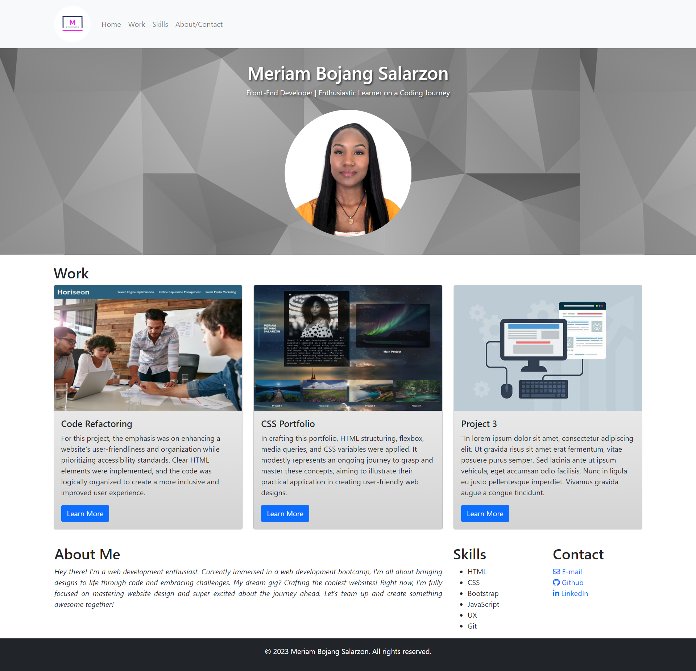

# Bootstrap Portfolio

## Description

This project involves building a personal portfolio layout using the Bootstrap CSS Framework. The motivation behind this project is to gain hands-on experience with HTML, CSS, GitHub, GitHub Pages, and Bootstrap. It goes beyond being a homework assignment, serving as a practical application of the skills acquired in web development.

The portfolio addresses the need for a professional and responsive layout that showcases projects, skills, and personal information. Through this project, I learned how to leverage Bootstrap to create a visually appealing and accessible web design.

## Table of Contents

- [Installation](#installation)
- [Usage](#usage)
- [Credits](#credits)
- [License](#license)

## Installation

To run this project locally, follow these steps:

1. Clone the GitHub repository to your local machine.
2. Navigate to the project directory.
3. Open the `index.html` file in your preferred web browser.

## Usage

[Link to deployed application](https://msalarzon.github.io/Bootstrap-Portfolio/)

Explore my dynamic portfolio for:

- Insights into my background, skills, and experiences.
- Detailed views and descriptions of showcased projects with images.
  (Image/text placeholders have been used in some sections as templates for future content).
- Effortless navigation through portfolio sections via intuitive links.
- A responsive design for an optimal viewing experience on various devices.

The portfolio includes the following sections:

### Navigation Bar

A responsive navigation bar provides links to different sections of the portfolio.

### Hero Section

A jumbotron featuring a picture, name, and additional information.

### Work Section

Bootstrap cards showcase various projects, each with a brief description and a link to the corresponding project work.

### Skills Section

A list of skills expected to be learned during the boot camp.

### About/Contact Section

An About Me section and contact information are included in the same row.

## Credits

Special thanks to the following:

- [Bootstrap](https://getbootstrap.com/): For providing a robust CSS framework.
- [GitHub](https://github.com/): For version control and project hosting.
- [edX](https://www.edx.org/): Learning Platform for providing a valuable learning experience.
  
## License

This project is licensed under the [MIT License](LICENSE).
